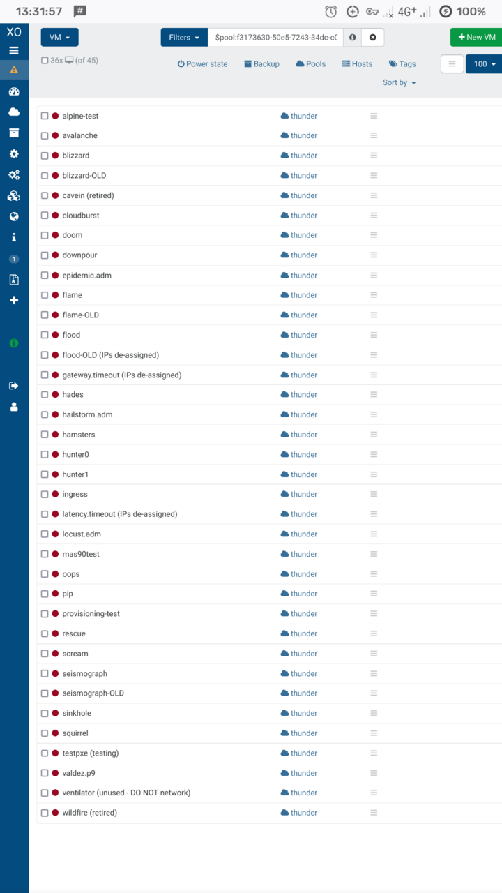

On Saturday 9th April 2022, the SRCF completed the bulk of its physical server relocation.  We moved out of 17 Mill Lane, home to Cambridge SU's former offices and in central Cambridge, and into the Roger Needham Building of University Information Services, over on the West Cambridge site.

<!--more-->

[](https://srcf-volunteers.soc.srcf.net/pictures/move-west/IMG_20220409_143313_edit.jpg)

As well as saving us from the imminent destruction of our previous home, the move provides us with an industry-standard datacentre to hold and run our equipment.

If you're interested in a breakdown of what's in the rack, take a look at [our previous blog post](../server-rack/)!

### Disconnecting VM hosts

Once we'd set up some initial VM capacity in the new datacentre, we needed to power down the remaining hosts in the old rack.  Before we can do that, the hosts need to be cleared of any currently running VMs.

The Xen hypervisor allows moving VMs transparently between hosts, a feature called migration.  Typically this requires support from the VM itself, by installing guest tools (similar to VirtualBox and other virtualisation platforms).

[](https://srcf-volunteers.soc.srcf.net/pictures/move-west/IMG_20220409_113340.jpg)

In addition to our more production-grade offerings, the SRCF also runs more experimental software setups -- one instance of this is a [Plan 9](https://9p.io/plan9/) server, `valdez`.

Xen does some checks to see if the VM can safely be migrated, and it refuses to move Plan 9:

```
[11:43 volutus /]# xe vm-migrate uuid=$valdez host=uncinus
You attempted an operation on a VM which lacks the feature.
```

...but that doesn't mean we can't try anyway!  Once we retried with an added `--force`, the migration was successful with no apparent issues.

[](https://srcf-volunteers.soc.srcf.net/pictures/move-west/IMG_20220409_114633.jpg)

With the VM hosts deprived of VMs, we could go ahead and power them off, unplug the various cables (power, Ethernet, VGA), and remove them from the rack, along with the console.

[](https://srcf-volunteers.soc.srcf.net/pictures/move-west/IMG_20220409_115329.jpg)

[](https://srcf-volunteers.soc.srcf.net/pictures/move-west/IMG_20220409_121241.jpg)

Each server sits between two extendable rails, one on each side of the rack; once unplugged, we can pull a machine forwards, detach and lift it off of the rails.  The rails themselves are each clipped or screwed to the two left or two right columns of the rack, and as with most things like this, there's always one or two that are a pain to snap into or out of place.

### Powering off VMs

Some time later, only the NetApp and UPSes were left.  Unfortunately we needed downtime at this point, as the NetApp houses the disks for all the VMs and needed to be physically relocated.

Though we have the ability to also migrate disks between hosts, it's a slow process: a snapshot is created and transferred, whilst any disk writes in the meantime have to be replicated after the transfer, so we'd be waiting hours to get everything moved across.

We proceeded to alert and, shortly after, power down the rest of the VMs.

```
Broadcast message from rsa33-adm@doom (pts/1) (Sat Apr  9 12:53:04 2022):

Shutting down shortly due to physical server relocation.  Please save your
work and log out.
```

We have `molly-guard` installed to avoid accidental use of power commands in unintended terminals:

```
rsa33-adm@pip:~$ sudo shutdown now
W: molly-guard: SSH session detected!
Please type in hostname of the machine to reboot: pip
```

With everything switched off, our VM list was looking unusually red:

[](https://srcf-volunteers.soc.srcf.net/pictures/move-west/Screenshot_20220409_133159.png)

### Disconnecting disks

With all the servers offline, the disks were no longer in use and we could proceed with powering down the NetApp.

[](https://srcf-volunteers.soc.srcf.net/pictures/move-west/IMG_20220409_134510.jpg)

With the rack console removed, we needed to make an actual serial console connection to the machine using [PuTTY](https://www.chiark.greenend.org.uk/~sgtatham/putty/).  The high-availability takeover could be seen when powering off the first controller:

```
elmer> halt
warning: this system may be taken over by its HA partner. If you do not want
this to occur, type 'cf disable' on the partner system. You can also use
'halt -f' option to prevent unwanted takeovers.
Waiting for PIDS:  702.
Terminated
```

After a few minutes of waiting for processes to end, the controller eventually shut down... and rebooted.  Seems like it was keen to stay alive.

```
Boot Loader version 3.6
Copyright (C) 2000-2003 Broadcom Corporation.
Portions Copyright (C) 2002-2014 NetApp, Inc. All Rights Reserved.

CPU Type: Intel(R) Xeon(R) CPU           L5410  @ 2.33GHz
LOADER-A>
LOADER-A> sp status
Firmware Version:   1.4.4P1
Ethernet Link:      No Link
 IPv4:              Disabled
IPv6 Settings
 Global Address:    Disabled
 Router Advertisement Address: Disabled
 Link Local Address: Disabled
```

It had rebooted into a basic boot shell rather than into full operation again, so at this point it was safe to just cut the power.  Rinse and repeat with the second controller, then we could go ahead and unrack the controllers and disks.

### Loading up and driving out

What's the best way to move a stack of heavy servers out of a building and into a vehicle?

[](https://srcf-volunteers.soc.srcf.net/pictures/move-west/IMG_20220409_141847.jpg)

[](https://srcf-volunteers.soc.srcf.net/pictures/move-west/IMG_20220409_142313.jpg)

[](https://srcf-volunteers.soc.srcf.net/pictures/move-west/IMG_20220409_142411.jpg)

After a bit of back-and-forth between the server room and the car park, we had a van loaded up with 19U of servers, disks and switches, all of their rails, a box full of cables, and plenty of room to spare.

### Putting it back together again

A relatively quick drive later (thankfully the lunchtime traffic had subsided a bit by now), we were parked up at the Roger Needham Building, and it was time to undo the morning's work and rebuild the rack.

[](https://srcf-volunteers.soc.srcf.net/pictures/move-west/IMG_20220409_154242.jpg)

[](https://srcf-volunteers.soc.srcf.net/pictures/move-west/IMG_20220409_161500.jpg)

This unfortunately took quite a while, as the locations and wiring of the various servers was carefully considered -- there's no better opportunity to do a fresh cabling plan than when your rack is empty.

The NetApp was brought back online at around 19:45, with six hours' downtime.  VM hosts and VMs started being restored from 20:00.

Rebuild complete, the volunteers headed down to the pub to contemplate the day's hard work.
