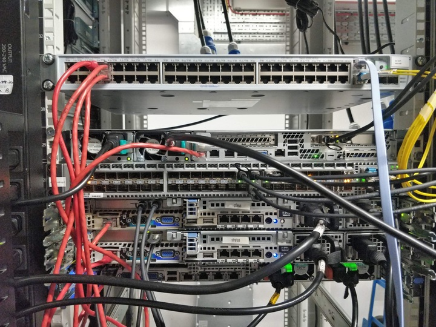

The SRCF owns and maintains a selection of hardware, mostly acquired through donations from third parties (such as other university departments, or local companies) replacing their own kit.

<!--more-->

Most of the servers in our server rack are used to run our own services, though we also share the rack space with [Cambridge SU](https://www.cambridgesu.co.uk) and [Cam FM](https://www.camfm.co.uk).

This is a whistle-stop tour of our hardware and where it lives, compiled during [our recent move to the West Cambridge site](../move-west/).  The picture above is of the completed rack in the new datacentre; most of the pictures below were of the same kit but during the dismantling of the old rack in Mill Lane.

### Virtual machine hosts

Most of the SRCF's services -- such as the shell server `pip`, the web server `sinkhole`, and the games server `doom` -- are run on [virtual machines](https://www.srcf.net/vms).  These VMs are spread across a number of physical machines, each running the [Xen hypervisor](https://xenproject.org).

Amongst other things, this allows us to adjust features like the number of CPUs or amounts of memory assigned to each VM, without needing to fiddle with the hardware, as well as move a VM between servers without downtime -- useful when we need to reboot servers following security patches and updates.

VMs and their hosts are logically grouped into pools.  The hosts that make up our main pool `thunder` currently provide a total of 636GB of RAM and 68 CPU cores.  Memory is dedicated (each VM takes a slice of the total for itself), whereas CPUs are virtual and can exceed the number of physical cores on a host (though of course the performance will be reduced as CPU contention increases).

### File storage servers

The hard disks for all our VMs are mounted over NFS (Network File System) from a single server -- we use a NetApp appliance for this purpose.  This consists of a pair of controllers (`elmer` and `eldo`) in order to provide some redundancy: both controllers know how to take over from the other in the event of a failure, and they will automatically bind to their partner's IP addresses, take over management of their partner's disks, and so on.

Each drive bay contains a 2TB hard drive, for a total of 48TB of storage in each disk shelf.  We make use of RAID-DP (Redundant Array of Inexpensive Disks, double parity), the NetApp's default offering of RAID and a variant of [RAID-4](https://en.wikipedia.org/wiki/Standard_RAID_levels#RAID_4), for fault tolerance: even with two failed disks, we're protected against any data loss, and have the time to source and install replacement disks.

Contained within these disks are the root disks (i.e. `/`) of each VM, as well as boot and swap partitions.  We also have separate user data storage -- `/home` and `/societies`, `/public`, Hades mail, backups and archives -- which can be mounted across multiple VMs (for example, making user home directories available on all user-facing servers).

A second NetApp and disk shelf lives in the [West Cambridge Data Centre](https://help.uis.cam.ac.uk/service/network-services/hosting-services/hosting/data-centre), and holds VM backups and user data snapshots managed by the NetApp's SnapVault feature.  We use [Wireguard](https://www.wireguard.com) to encrypt data in transit between the two sites.

### Console

Each server in the rack has a VGA output.  Occasionally, things might go wrong and we can't SSH into a server, meaning we need to open a terminal standing at the machine.  Whilst we could connect a monitor and keyboard, this is a bit cumbersome.

For convenience, one unit of the rack is a fold-out screen and keyboard (i.e. a laptop on rails), connected to and switchable between any of the servers.

### Backup power supply

In the event of a power failure, a UPS (uninterruptible power supply) provides backup power to other servers in the rack.  The battery life isn't very long (about 10 minutes for everything connected), but it signals to connected servers that power has been lost so that they can shut down gracefully.

In the new datacentre, the power supplies are already backed by UPSes (that is, the power feed itself is uninterruptible), so these are no longer required in the new rack.

### Switch

Each server is also connected via Ethernet to the switch at the top of the rack.

The SRCF has a pool of globally-routable (accessible outside of the University Data Network, the UDN) IPv4 and IPv6 addresses, with one of each assigned to each physical server and VM.  In addition, we have a handful of role IP addresses, such as that of `webserver.srcf.net` (used by custom domains making use of our web hosting), which can be moved between servers as we restructure our services.

The switch also provides an internal network, similar to that of a consumer router, which allows servers to communicate with each other securely without data leaving the rack.

### Point-of-presence

The switch in our server rack doesn't connect directly to the university network.  Instead, we're behind a second switch: a [point-of-presence](https://help.uis.cam.ac.uk/service/network-services/datanetwork/pop-switch), managed by UIS (University Information Services).  The PoP doesn't live in our server rack, or indeed even in the same building -- it's located inside another building on Mill Lane, alongside one of the UIS core routers.

The [Granta Backbone Network](https://help.uis.cam.ac.uk/service/network-services/fibre) is an underground network of fibre that connects all the Cambridge colleges and departments.  The SRCF and CamSU switches at West Cambridge, and the PoP inside Mill Lane, are connected via two 10G (10 Gigabits per second) links from the GBN.  The two switches themselves are connected to each other via 10G as well, which allows the whole network to remain online in the event of either of the GBN links failing.
